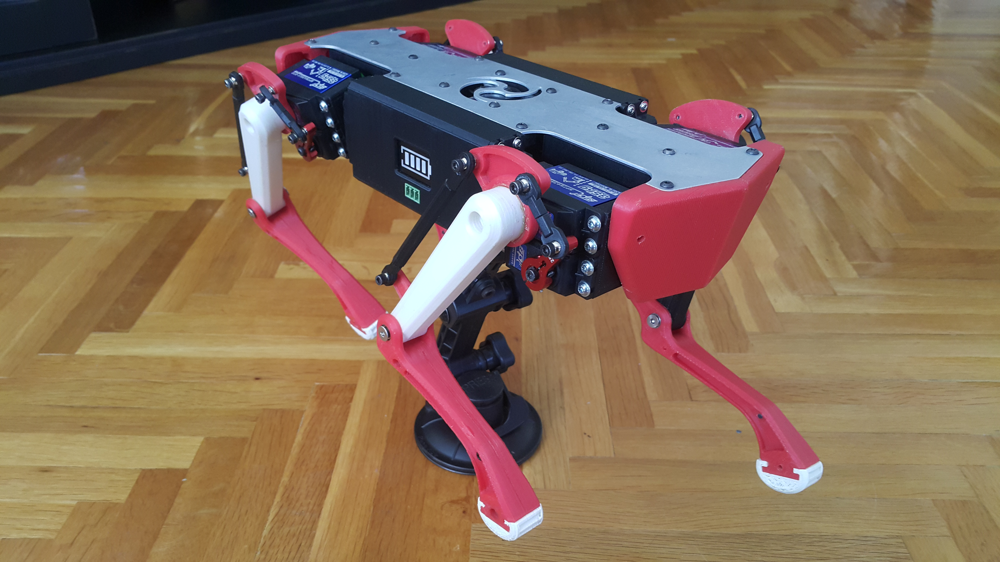
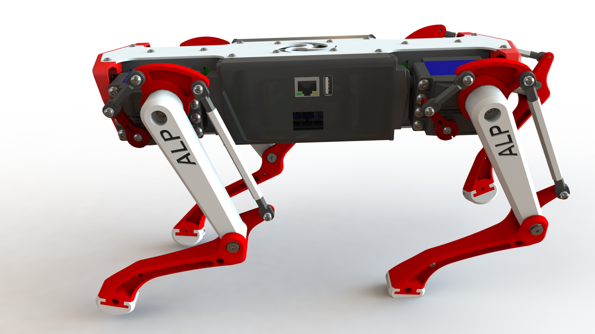

# botAlive_RoboDog

### Final Year Project :

- We are building a Robot Dog mimicing the Spot Robot from Boston Dynamics.

---

### Images :

#### A :


#### B : 


---

### Guidelines :

- Use the README.md as your bible for the history. 
- Add all the minor/major contributions to the code diligently with every push. 
- Using Semantic versioning 2.0.0 for development and rollout.
- Patch version Z (x.y.Z | x > 0) MUST be incremented if only backwards compatible bug fixes are introduced. A bug fix is defined as an internal change that fixes incorrect behavior.
- Minor version Y (x.Y.z | x > 0) MUST be incremented if new, backwards compatible functionality is introduced to the public API. It MUST be incremented if any public API functionality is marked as deprecated. It MAY be incremented if substantial new functionality or improvements are introduced within the private code. It MAY include patch level changes. Patch version MUST be reset to 0 when minor version is incremented.
- Major version X (X.y.z | X > 0) MUST be incremented if any backwards incompatible changes are introduced to the public API. It MAY also include minor and patch level changes. Patch and minor version MUST be reset to 0 when major version is incremented.
- Please add proper commenting in the code for every functionality additions. Help others to help you.
- <https://www.markdownguide.org/cheat-sheet/>   Markdown cheatsheet in case you need it.
- Use the following markdown extension for visual studio code, 
  - Description: Markdown linting and style checking for Visual Studio Code, <https://marketplace.visualstudio.com/items?itemName=DavidAnson.vscode-markdownlint>
  - Description: All you need to write Markdown (keyboard shortcuts, table of contents, auto preview and more), <https://marketplace.visualstudio.com/items?itemName=yzhang.markdown-all-in-one>

- Markdown usage
  - Ctrl/Cmd + B : Toggle bold
  - Ctrl/Cmd + I : Toggle italic
  - Ctrl/Cmd + Shift + ] : Toggle heading (uplevel)
  - Ctrl/Cmd + Shift + [ : Toggle heading (downlevel)
  - Ctrl/Cmd + M : Toggle math environment
  - Alt + C : Check/Uncheck task list item
  - Ctrl/Cmd + Shift + V : Toggle preview
  - Ctrl/Cmd + K V : Toggle preview to side

- Commit message types

  ```
  - feature : Whenever a feature is added use this in your commit message
  - bugfix  : Whenever a bug is fixed within the code use this
  - bug     : Whenever a bugged code is pushed to maintain the history use this tag
  - texts   : Whenever any links or any papers are added to the repo
  - donotuse (italics) : Whenever you want to convey that this commit should not be used for any purpose, use this tag
  ```

---
### Folder Structure :
    .
    ├── ...
    ├── botAlive_RoboDog        # Repository
    │   ├── Links	         # Contains some helpful links
    │   ├── ResearchPapers      # Contains needed research papers
    │   ├── Images              # For keeping all the images   
    │   ├── LICENSE             # MIT License
    │   └── README.md           # For Documenting
    └── ...
    
---    
### Change Logs :

#### 0.0.1 (texts)
- Added few helpful links.
- Added few research papers for reading.

#### 0.0.2 (texts)
- Made some required changes in README
- Added links in links.txt

#### 0.0.3 (texts)
- Made some required changes in README
- Added images to the repository
